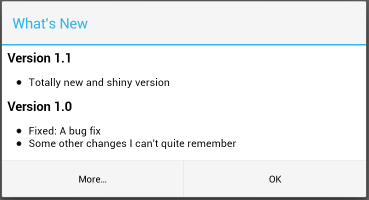
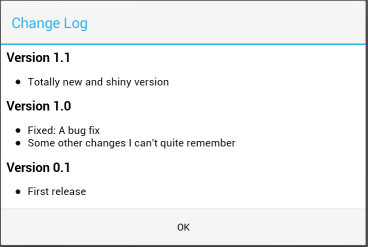

[](https://travis-ci.org/cketti/ChangeLog)
[](https://jitpack.io/#hannesa2/ChangeLog)


# ChangeLog - An Android Library to display a Change Log




This library provides an easy way to display a change log in your app.

## Usage

1. Create the master change log in `res/xml/changelog_master.xml`. Formatted like this:

  ```xml
  <?xml version="1.0" encoding="utf-8"?>
  <changelog>
      <release version="1.1" versioncode="11" >
          <change>Totally new and shiny version</change>
      </release>
      <release version="1.0" versioncode="10" >
          <change>Fixed: A bug fix</change>
          <change>Some other changes I can't quite remember</change>
      </release>
      <release version="0.1" versioncode="1">
          <change>First release</change>
      </release>
  </changelog>
  ```

2. Create translations of this `changelog_master.xml` file in files named `changelog.xml` under
language-specific versions of `res/xml/`, e.g. `res/xml-de/changelog.xml`.

3. Display the change log dialog by putting the following code in your Activity's `onCreate()` method:

  ```java
  DialogChangeLog changeLog = DialogChangeLog.newInstance(this);
  if (changeLog.isFirstRun()) {
      changeLog.getLogDialog().show();
  }
  ```

## Include the library

The easiest way to add ckChangeLog to your project is via Gradle. Just add the following lines to your `build.gradle`:

```groovy
allprojects {
    repositories {
        ...
        maven { url 'https://jitpack.io' }
    }
}
```
```
dependencies {
     compile 'com.github.hannesa2:ChangeLog:V2.0.0'
}
```

## Customize labels

In order to change the labels of the dialog add the following items to your `strings.xml`:

```xml
<string name="changelog_full_title">Change Log</string>
<string name="changelog_title">What\'s New</string>
<string name="changelog_ok_button">OK</string>
<string name="changelog_show_full">More…</string>
<string name="changelog_version_format">Version <xliff:g id="version_name">%s</xliff:g></string>
```

## License

    Copyright (C) 2012-2017 hannesa2 and contributors

    Licensed under the Apache License, Version 2.0 (the "License");
    you may not use this file except in compliance with the License.
    You may obtain a copy of the License at

       http://www.apache.org/licenses/LICENSE-2.0

    Unless required by applicable law or agreed to in writing, software
    distributed under the License is distributed on an "AS IS" BASIS,
    WITHOUT WARRANTIES OR CONDITIONS OF ANY KIND, either express or implied.
    See the License for the specific language governing permissions and
    limitations under the License.
